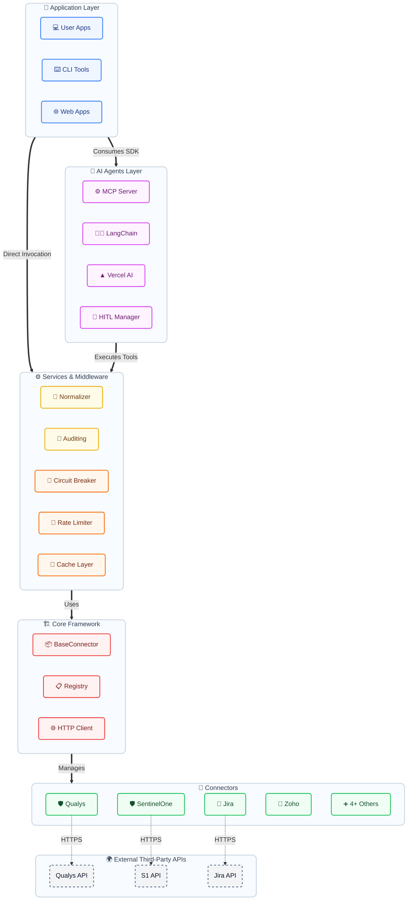

# Complyment Connectors SDK

## Executive Summary

The **@skill-mine/complyment-connectors-sdk** is an enterprise-grade TypeScript SDK that provides unified integration with 6+ security and business tools. Built internally at Skill-Mine Technology, this SDK enables rapid development of security automation features for the Complyment platform.

---

## Key Highlights

| Metric | Value |
|--------|-------|
| Connectors | 6 (Qualys, SentinelOne, Checkpoint, ManageEngine, Jira, Zoho) |
| AI Framework Support | 4 (MCP, LangChain, Vercel AI, OpenAI Agents) |
| Build Output | ~170 KB (CJS + ESM) |
| TypeScript | 100% type-safe |
| License | MIT |

---

## Problem Statement

Before this SDK:
- Each connector required separate implementation
- No standardized error handling or retry logic
- AI agent integration required custom code per tool
- No unified schema across security tools
- Duplicate code across projects

## Solution

The Complyment Connectors SDK provides:
- **Unified API** - Consistent interface across all connectors
- **Built-in Resilience** - Circuit breaker, retry, rate limiting
- **AI-Ready** - Pre-built adapters for major AI frameworks
- **Normalized Data** - Cross-connector unified schemas
- **Enterprise Features** - Audit logging, HITL approvals, observability

---

## Supported Connectors

### Security Tools

| Connector | Purpose | Key Features |
|-----------|---------|--------------|
| **Qualys** | Vulnerability Management | Asset discovery, vulnerability scanning, compliance |
| **SentinelOne** | Endpoint Security | Threat detection, quarantine, agent management |
| **Checkpoint** | Firewall Management | Policy management, rule creation, threat blocking |
| **ManageEngine** | Patch Management | Missing patches, deployment, compliance |

### Business Tools

| Connector | Purpose | Key Features |
|-----------|---------|--------------|
| **Jira** | Issue Tracking | Security tickets, workflow automation |
| **Zoho CRM** | Customer Management | Contacts, leads, deals |

---

## Architecture



*For more in-depth diagrams, including Data Flow, Class Hierarchies, and AI integration workflows, please refer to the [Detailed Architecture Guide](./Detailed-Architecture.md).*

---

## AI Agent Integration

The SDK is designed for AI-first development, supporting major frameworks:

### Model Context Protocol (MCP)
```typescript
const mcp = new MCPServer({ name: 'security-mcp' })
mcp.registerConnectorTools('qualys', createQualysMCPTools(qualys))

// AI agents can now call security tools directly
const result = await mcp.executeTool('qualys_get_critical_vulnerabilities', {})
```

### LangChain
```typescript
const tools = LangChainAdapter.createAllTools({ qualys, sentinelone, jira })
// Use with any LangChain agent
```

### Vercel AI SDK
```typescript
const tools = VercelAIAdapter.createFullToolSet({ qualys, sentinelone })
// Use with generateText(), streamText()
```

### Human-in-the-Loop (HITL)
```typescript
const hitl = new HITLManager({
  autoApproveRiskLevels: ['low'],
  onApprovalRequired: (req) => notifySecurityTeam(req),
})

// High-risk actions require human approval
await hitl.requestApproval({
  actionType: 'threat.quarantine',
  riskLevel: 'high',
  description: 'Quarantine ransomware on production server',
})
```

---

## Resilience Features

| Feature | Description | Default |
|---------|-------------|---------|
| **Circuit Breaker** | Prevents cascading failures | 5 failures, 60s recovery |
| **Rate Limiting** | Respects API quotas | Configurable per connector |
| **Retry with Backoff** | Handles transient failures | 3 retries, exponential backoff |
| **Caching** | Reduces API calls | 5 min TTL, 1000 entries |

---

## Data Normalization

Unified vulnerability schema across all security tools:

```typescript
// Data from Qualys, SentinelOne, etc. normalized to single format
const normalized = normalizationEngine.normalizeVulnerabilities([
  { connector: 'qualys', data: qualysVulns, mapper: qualysMapper },
  { connector: 'sentinelone', data: s1Threats, mapper: s1Mapper },
])

// Deduplicated by CVE, highest severity preserved
console.log(normalized.data)  // Unified format
console.log(normalized.stats) // { critical: 3, high: 7, medium: 12 }
```

---

## Observability

### OpenTelemetry Tracing
```typescript
// Automatic span creation for all connector calls
await tracer.trace({ name: 'fetch-vulnerabilities', connector: 'qualys' }, async () => {
  return qualys.getCriticalVulnerabilities()
})
```

### Audit Logging
```typescript
// Compliance-ready audit trail
auditLogger.logSuccess('data.fetch', 'qualys', { count: 42 }, 320)

// Export for compliance reports
const csv = auditLogger.exportAsCsv()
const json = auditLogger.exportAsJson()
```

---

## Benefits

### For Development Team
- **Faster Development** - Pre-built connectors, no boilerplate
- **Type Safety** - Full TypeScript, catch errors at compile time
- **Consistent Patterns** - Same API across all connectors
- **AI-Ready** - No extra work for AI agent integration

### For Operations
- **Reliability** - Built-in circuit breaker, retry logic
- **Observability** - Tracing, logging, audit trail
- **Security** - HITL for critical actions, secrets management

### For Business
- **Reduced Time-to-Market** - Faster feature delivery
- **Lower Maintenance** - Centralized connector logic
- **Compliance** - Audit logging, approval workflows
- **Scalability** - Production-ready patterns

---

## Installation & Usage

### Internal Installation
```bash
pnpm install git+https://github.com/IMMANAPK/complyment-connectors-sdk.git
```

### Quick Start
```typescript
import {
  QualysConnector,
  SentinelOneConnector,
  registry
} from '@skill-mine/complyment-connectors-sdk'

// Initialize
const qualys = new QualysConnector({
  baseUrl: process.env.COMPLYMENT_QUALYS_BASE_URL,
  username: process.env.COMPLYMENT_QUALYS_USERNAME,
  password: process.env.COMPLYMENT_QUALYS_PASSWORD,
})

// Register globally
registry.register('qualys', qualys)

// Use
const vulns = await qualys.getCriticalVulnerabilities()
```

---

## Tech Stack

| Technology | Purpose |
|------------|---------|
| TypeScript 5.x | Type-safe development |
| tsup | Dual ESM/CJS build |
| axios | HTTP client |
| zod | Runtime validation |

---

## Build Output

```
dist/
├── index.js      170 KB  (CommonJS - Node.js)
├── index.mjs     166 KB  (ESM - Modern bundlers)
├── index.d.ts     76 KB  (TypeScript declarations)
└── index.d.mts    76 KB  (TypeScript ESM declarations)
```

---

## Roadmap

### Phase 1 (Current - v0.1.0)
- [x] 6 Core Connectors
- [x] AI Framework Adapters
- [x] Resilience Middleware
- [x] Normalization Engine

### Phase 2 (Planned)
- [ ] Additional Connectors (Tenable, CrowdStrike, ServiceNow)
- [ ] GraphQL API layer
- [ ] Real-time streaming improvements
- [ ] Enhanced semantic search with embeddings

### Phase 3 (Future)
- [ ] Public npm release
- [ ] CLI tool for connector scaffolding
- [ ] Visual workflow builder integration

---

## Author

**Immanuvel** - Backend Developer, Skill-Mine Technology Consulting

---

## Repository

- **GitHub**: https://github.com/IMMANAPK/complyment-connectors-sdk
- **Package**: @skill-mine/complyment-connectors-sdk
- **Version**: 0.1.0

---

## Contact

For questions or support, contact the development team.
